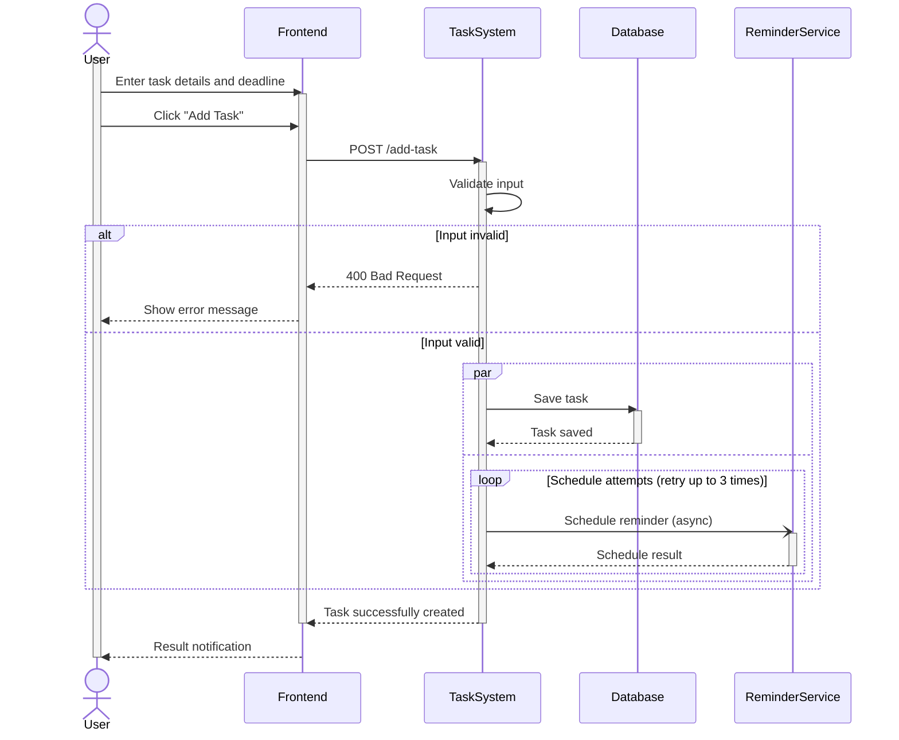

```mermaid
sequenceDiagram
    actor User
    participant Frontend
    participant TaskSystem
    participant Database
    participant ReminderService

    activate User
    User->>Frontend: Enter task details and deadline
    activate Frontend
    User->>Frontend: Click "Add Task"
    Frontend->>TaskSystem: POST /add-task

    activate TaskSystem
    TaskSystem->>TaskSystem: Validate input

    alt Input invalid
        TaskSystem-->>Frontend: 400 Bad Request
        Frontend-->>User: Show error message
    else Input valid
        par
            TaskSystem->>Database: Save task
            activate Database
            Database-->>TaskSystem: Task saved
            deactivate Database
        and
            loop Schedule attempts (retry up to 3 times)
                TaskSystem-)ReminderService: Schedule reminder (async)
                activate ReminderService
                ReminderService-->>TaskSystem: Schedule result
                deactivate ReminderService
            end
        end
    end

    TaskSystem-->>Frontend: Task successfully created
    deactivate Frontend

    deactivate TaskSystem
    Frontend-->>User: Result notification
    deactivate User

```