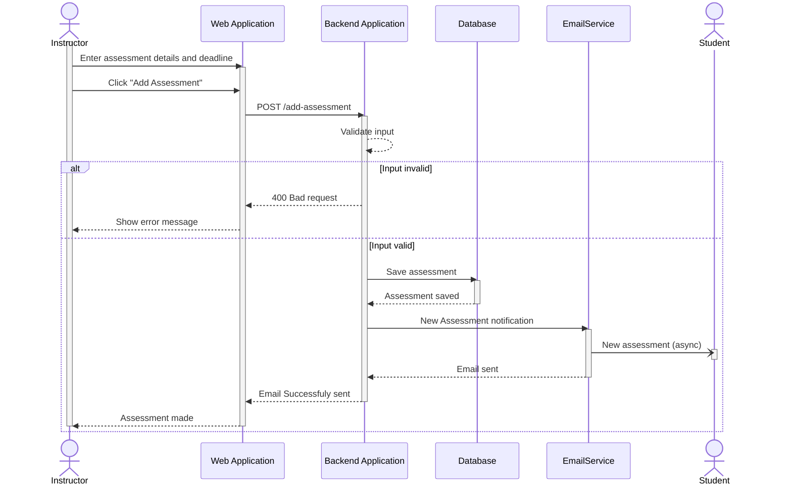

```mermaid
sequenceDiagram
    actor Instructor
    participant WA as Web Application
    participant BA as Backend Application
    participant Database
    participant EmailService
    actor Student

    activate Instructor
    Instructor->>WA: Enter assessment details and deadline
    activate WA
    Instructor->>WA: Click "Add Assessment"
    WA->>BA: POST /add-assessment

    activate BA
    BA-->>BA: Validate input

    alt Input invalid
        BA-->>WA: 400 Bad request
        WA-->>Instructor: Show error message
    else Input valid
        BA->>Database: Save assessment
        activate Database
        Database-->>BA: Assessment saved
        deactivate Database

        BA->>EmailService: New Assessment notification
        activate EmailService
        EmailService-)Student: New assessment (async)
        activate Student
        deactivate Student
        EmailService-->>BA: Email sent
        deactivate EmailService

        BA-->>WA: Email Successfuly sent
        deactivate BA
        WA-->>Instructor: Assessment made
        deactivate WA
        deactivate Instructor

    end
```