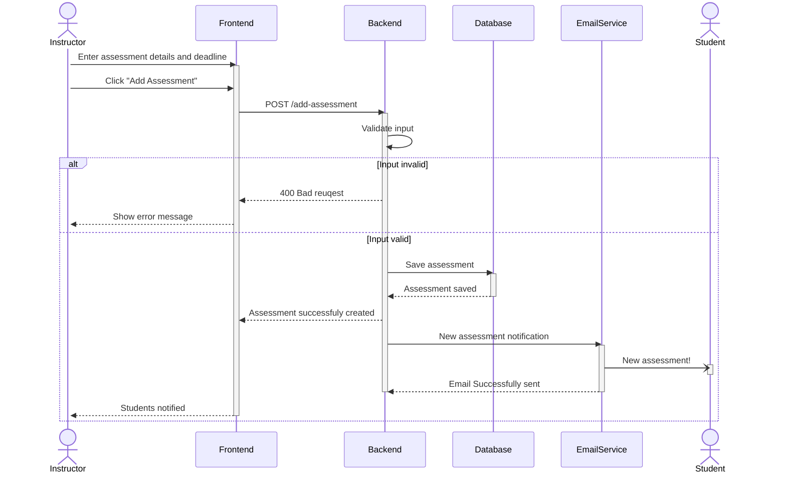

```mermaid
sequenceDiagram
    actor Instructor
    participant Frontend
    participant Backend
    participant Database
    participant EmailService
    actor Student

    activate Instructor
    Instructor->>Frontend: Enter assessment details and deadline
    activate Frontend
    Instructor->>Frontend: Click "Add Assessment"
    Frontend->>Backend: POST /add-assessment

    activate Backend
    Backend->>Backend: Validate input

    alt Input invalid
        Backend-->>Frontend: 400 Bad reuqest
        Frontend-->>Instructor: Show error message
    else Input valid
        Backend->>Database: Save assessment
        activate Database
        Database-->>Backend: Assessment saved
        deactivate Database

        Backend-->>Frontend: Assessment successfuly created

        Backend->>EmailService: New assessment notification
        activate EmailService
        EmailService-)Student: New assessment!
        activate Student
        deactivate Student
        EmailService-->>Backend: Email Successfully sent
        deactivate EmailService

        deactivate Backend 

        Frontend-->>Instructor: Students notified
        deactivate Frontend
    end
```